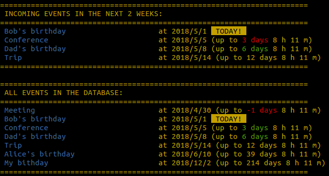

# terminder
reminder for linux console 

A small script to print user's defined incoming regular (such as birthdays, name's days) or irregular (meetings, trips) events in linux terminal.
Script is dedicated to users whose work is mainly based on terminal.

Here is an example terminal output:

Adding this script to `.bashrc` will cause that incomming events will be shown at every time when user open his consle:

	echo "TERMINDER_DIR=/path/to/terminder/dir" >> ~/.bashrc
	echo "alias terminder='python $TERMINDER_DIR/terminder.py" >> ~/.bashrc
	echo "terminder" >> ~/.bashrc

Example record of single event has to have the following form:

	{Text of the note, date in format YYYY/MM/DD for irregular or MM/DD for regular}

For some personal settings go to libs/config.py

Command `terminder` in console will provide output with default configuration. 
However, some options had been implemented:

* `-e` print all events instead of default option
